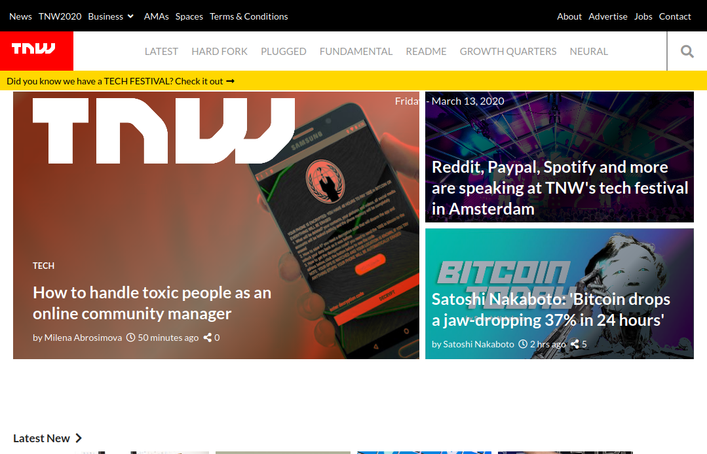

# TNW-clone
> What the project is about

This project consists of replicating the The Next Web website putting emphasis on how it behaves differently depending on the size of the screen where the website is rendered.

> How the project was done

The Lay out shows the basic structure of the page using empty semantic HTML elements that are appropriately sized and positioned.

Uses media queries to gracefully degrade the web page as the window size is reduced.

## Built With

- html, css
- vscode

## Live Demo

[Live Demo Link](https://raw.githack.com/jstloyal/TNW-clone/home-page/index.html)

## Getting Started

To get a local copy up and running follow these simple example steps.

### Prerequisites
- Web browser
- Code editor
- Git and Github

### Usage
- Clone the project to your local machine 
- Open the index file in your browser

## Authors

- Adetayo Sunkanmi

👤 **Author1**

- Github: [Adetayo Sunkanmi](https://github.com/jstloyal)
- Twitter: [Adetayo Sunkanmi](https://twitter.com/jstloyalty)
- Linkedin: [Adetayo Sunkanmi](https://www.linkedin.com/in/jstloyalty/)

👤 **Author2**

- Github: [Rose Wanjohi](https://github.com/blackpintz)
- Twitter: [Rose Wanjohi](https://twitter.com/blackpintz)

## 🤝 Contributing

Feel free to check the [issues page](https://github.com/jstloyal/TNW-clone/issues).

Contributions, issues and feature requests are welcome!

Start by:
* Forking the project
* Cloning the project to your local machine
* `cd` into the project directory
* Run `git checkout -b your-branch-name`
* Make your contributions
* Push your branch up to your forked repository
* Open a Pull Request with a detailed description to the development branch of the original project for a review

## Show your support

Give a ⭐️ if you like this project!

## Acknowledgments

- Google

## 📝 License

This project is [MIT](lic.url) licensed.